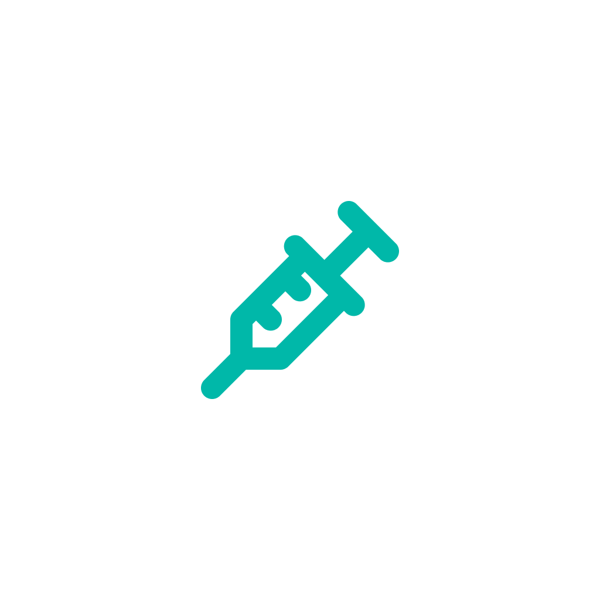

# 🐾 VaxPet - Pet Vaccine Management System

<div align="center">
  
  
  [](https://flutter.dev/)
  [](https://dart.dev/)
  [](LICENSE)
</div>

## 📋 Mô tả dự án

VaxPet là một ứng dụng di động toàn diện được phát triển bằng Flutter, chuyên về quản lý tiêm phòng và chăm sóc sức khỏe thú cưng. Ứng dụng giúp chủ thú cưng theo dõi lịch tiêm phòng, quản lý hồ sơ sức khỏe và đặt lịch hẹn với các phòng khám thú y.

## ✨ Tính năng chính

### 🏠 Trang chủ
- Dashboard tổng quan về thú cưng
- Thông báo nhắc nhở tiêm phòng
- Tìm kiếm và lọc thú cưng theo loại
- Giao diện người dùng trực quan với animation

### 🐕 Quản lý thú cưng
- **Đăng ký thú cưng mới**: Thêm thông tin chi tiết về thú cưng
- **Hồ sơ thú cưng**: Quản lý thông tin cá nhân (tên, giống, tuổi, giới tính, cân nặng, màu sắc)
- **Ảnh đại diện**: Upload và quản lý hình ảnh thú cưng
- **Microchip**: Quản lý thông tin chip điện tử

### 💉 Quản lý tiêm phòng
- **Lịch tiêm phòng**: Theo dõi các mũi tiêm đã thực hiện và sắp tới
- **Đặt lịch tiêm**: Đặt lịch hẹn tiêm phòng với phòng khám
- **Lịch sử tiêm**: Xem chi tiết lịch sử tiêm phòng
- **Nhắc nhở**: Thông báo tự động về lịch tiêm sắp tới

### 🏥 Dịch vụ y tế
- **Chứng nhận sức khỏe**: Quản lý giấy chứng nhận sức khỏe
- **Lịch hẹn khám**: Đặt và quản lý lịch hẹn khám sức khỏe
- **Ghi chú y tế**: Lưu trữ các ghi chú và theo dõi từ bác sĩ thú y

### 👤 Quản lý tài khoản
- **Đăng ký/Đăng nhập**: Hệ thống xác thực người dùng
- **Hồ sơ cá nhân**: Quản lý thông tin cá nhân
- **Membership**: Hệ thống thành viên với các ưu đãi
- **Điểm tích lũy**: Chương trình điểm thưởng

### 🌍 Tính năng bổ sung
- **Tìm phòng khám**: Tích hợp bản đồ Mapbox để tìm phòng khám gần nhất
- **Thông báo**: Hệ thống thông báo local và push notification
- **Mẹo chăm sóc**: Chia sẻ kiến thức chăm sóc thú cưng
- **Ưu đãi**: Quản lý voucher và chương trình khuyến mãi
- **Trợ giúp**: Hệ thống hỗ trợ người dùng

## 🏗️ Kiến trúc dự án

Dự án được xây dựng theo **Clean Architecture** với các layer rõ ràng:

```
lib/
├── main.dart                 # Entry point
├── service_locator.dart      # Dependency injection
├── common/                   # Shared components
│   ├── bloc/                 # Global BLoC states
│   ├── helpers/              # Utility functions
│   └── widgets/              # Reusable widgets
├── core/                     # Core functionality
│   ├── configs/              # App configurations
│   ├── network/              # Network setup
│   ├── constant/             # Constants
│   └── usecase/              # Base use cases
├── data/                     # Data layer
│   ├── models/               # Data models
│   ├── repositories/         # Repository implementations
│   └── sources/              # Data sources (API, local)
├── domain/                   # Business logic layer
│   ├── entities/             # Business entities
│   ├── repositories/         # Repository interfaces
│   └── usecases/             # Business use cases
└── presentation/             # UI layer
    ├── pages/                # Screen widgets
    ├── widgets/              # UI components
    └── bloc/                 # BLoC state management
```

## 🛠️ Công nghệ sử dụng

### Framework & Language
- **Flutter 3.7.2**: Cross-platform mobile development
- **Dart 3.7.2**: Programming language

### State Management
- **flutter_bloc 9.1.1**: BLoC pattern for state management
- **equatable 2.0.7**: Value equality for objects

### Networking & Data
- **dio 5.8.0**: HTTP client for API calls
- **dartz 0.10.1**: Functional programming (Either type)
- **shared_preferences 2.5.3**: Local data persistence

### UI & UX
- **flutter_svg 2.1.0**: SVG support
- **image_picker 1.1.2**: Image selection
- **flutter_local_notifications 17.2.3**: Local notifications

### Maps & Location
- **mapbox_maps_flutter 2.9.1**: Interactive maps
- **url_launcher 6.3.1**: External URL handling

### Utilities
- **get_it 8.0.3**: Dependency injection
- **logger 2.5.0**: Logging
- **intl 0.19.0**: Internationalization
- **path_provider 2.1.5**: File system paths
- **connectivity_plus 6.0.5**: Network connectivity
- **flutter_dotenv 5.2.1**: Environment variables

## 🚀 Hướng dẫn cài đặt

### Yêu cầu hệ thống
- Flutter SDK 3.7.2 hoặc cao hơn
- Dart SDK 3.7.2 hoặc cao hơn
- Android Studio / VS Code
- Android SDK (cho Android)
- Xcode (cho iOS - chỉ trên macOS)

### Cài đặt
1. **Clone repository**
   ```bash
   git clone <repository-url>
   cd VaxPet
   ```

2. **Cài đặt dependencies**
   ```bash
   flutter pub get
   ```

3. **Cấu hình environment**
   - Tạo file `.env.development` và `.env.production`
   - Thêm các biến môi trường cần thiết (API endpoints, keys)

4. **Tạo launcher icons**
   ```bash
   flutter pub run flutter_launcher_icons
   ```

5. **Chạy ứng dụng**
   ```bash
   # Development
   flutter run --flavor development

   # Production
   flutter run --flavor production
   ```

## 📱 Platform hỗ trợ

- ✅ **Android** (API 21+)
- ✅ **iOS** (iOS 12.0+)
- ✅ **Web**
- ✅ **Windows**
- ✅ **macOS**
- ✅ **Linux**

## 🔧 Scripts hữu ích

```bash
# Phân tích code
flutter analyze

# Chạy tests
flutter test

# Build APK
flutter build apk --release

# Build iOS
flutter build ios --release

# Clean project
flutter clean && flutter pub get
```

## 📄 Cấu trúc dữ liệu

### Pet Entity
```dart
class PetEntity {
  final int? petId;
  final String? name;
  final String? species;
  final String? breed;
  final String? age;
  final String? gender;
  final String? dateOfBirth;
  final String? weight;
  final String? color;
  final bool? isSterilized;
  // ... more fields
}
```

### Appointment Types
- **Vaccination Appointments**: Quản lý lịch tiêm phòng
- **Health Certificate Appointments**: Chứng nhận sức khỏe
- **Microchip Appointments**: Cấy chip điện tử

## 🎨 Theme & Design

Ứng dụng sử dụng Material Design với theme tùy chỉnh:
- **Primary Color**: Màu chủ đạo của brand
- **Background**: Giao diện sáng, thân thiện
- **Typography**: Font chữ rõ ràng, dễ đọc
- **Icons**: Cupertino Icons cho iOS, Material Icons cho Android

## 🔐 Bảo mật

- Xác thực người dùng an toàn
- Mã hóa dữ liệu nhạy cảm
- Validate input để tránh injection
- HTTPS cho tất cả API calls

## 🤝 Đóng góp

Dự án này là một Capstone Project. Để đóng góp:

1. Fork repository
2. Tạo feature branch (`git checkout -b feature/AmazingFeature`)
3. Commit changes (`git commit -m 'Add some AmazingFeature'`)
4. Push to branch (`git push origin feature/AmazingFeature`)
5. Tạo Pull Request

## 📞 Liên hệ & Hỗ trợ

- **Email**: [contact-email]
- **Issues**: Tạo issue trên GitHub
- **Documentation**: Xem thêm tại `/docs`

## 📜 License

Dự án này là private và không được phép publish lên pub.dev. Mọi quyền được bảo lưu.

---

<div align="center">
  Made with ❤️ by VaxPet Team
  <br>
  <em>Chăm sóc thú cưng - Yêu thương trọn vẹn</em>
</div>
